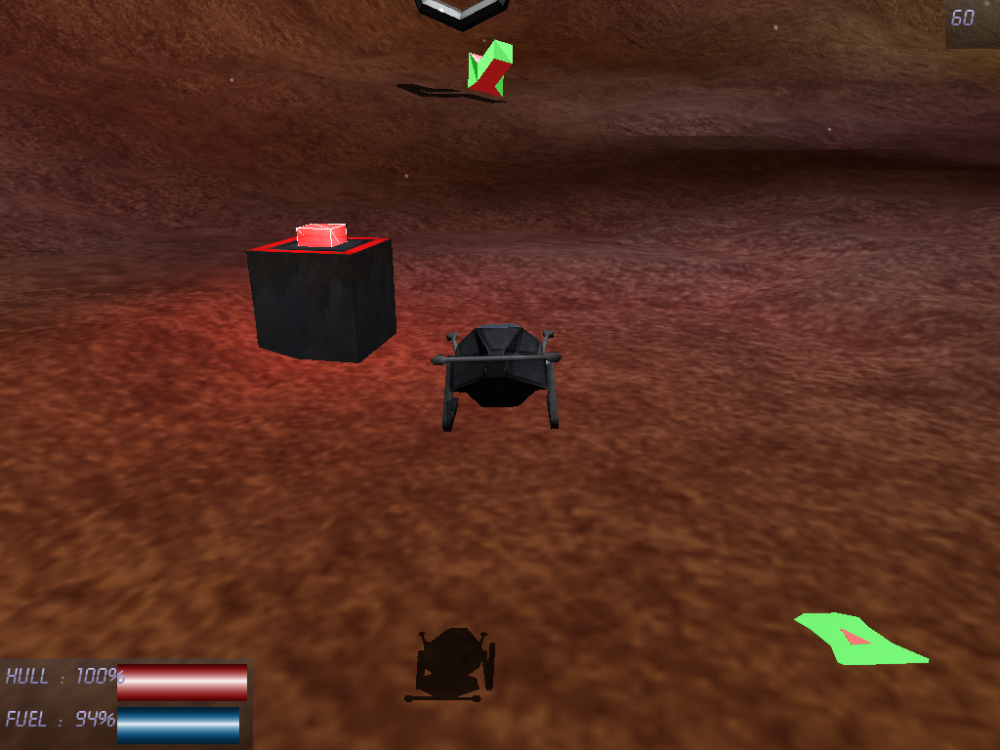
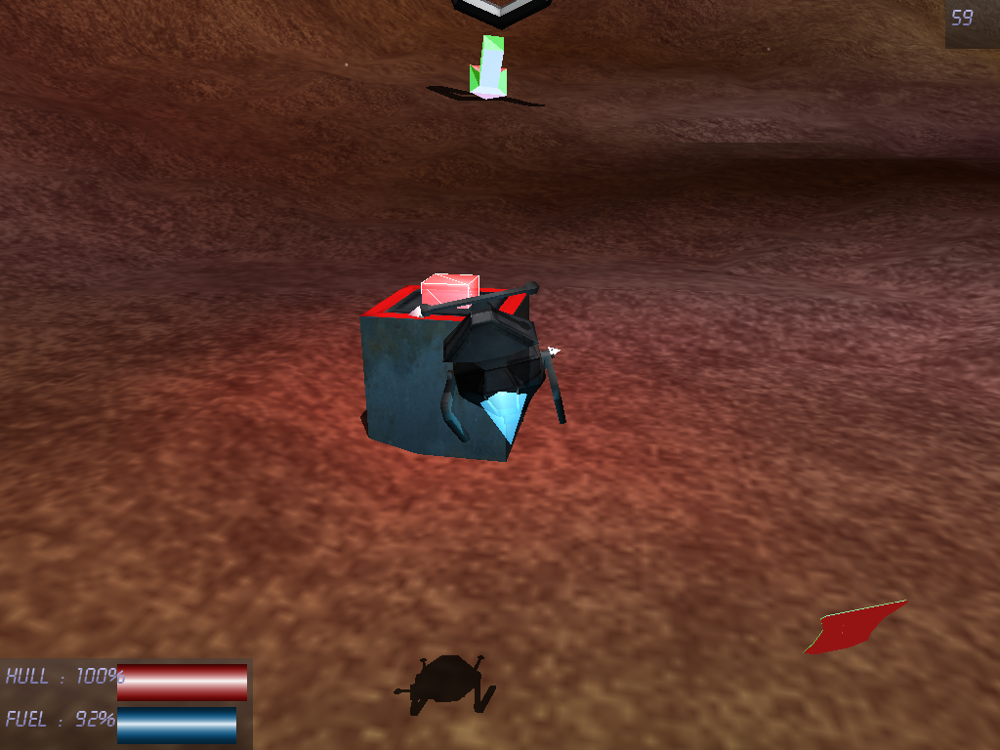
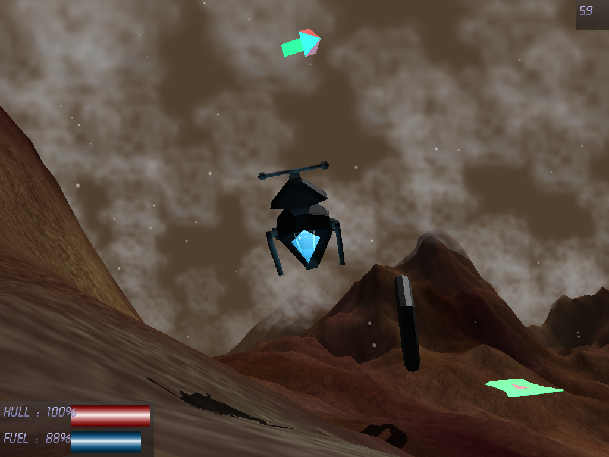
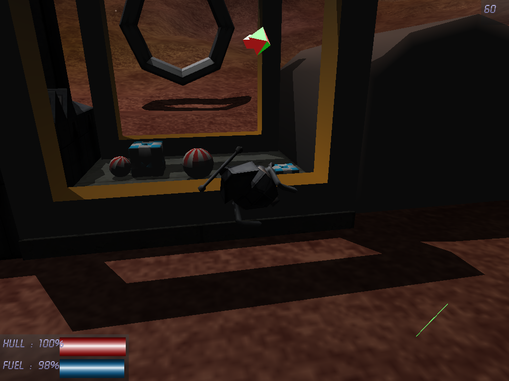
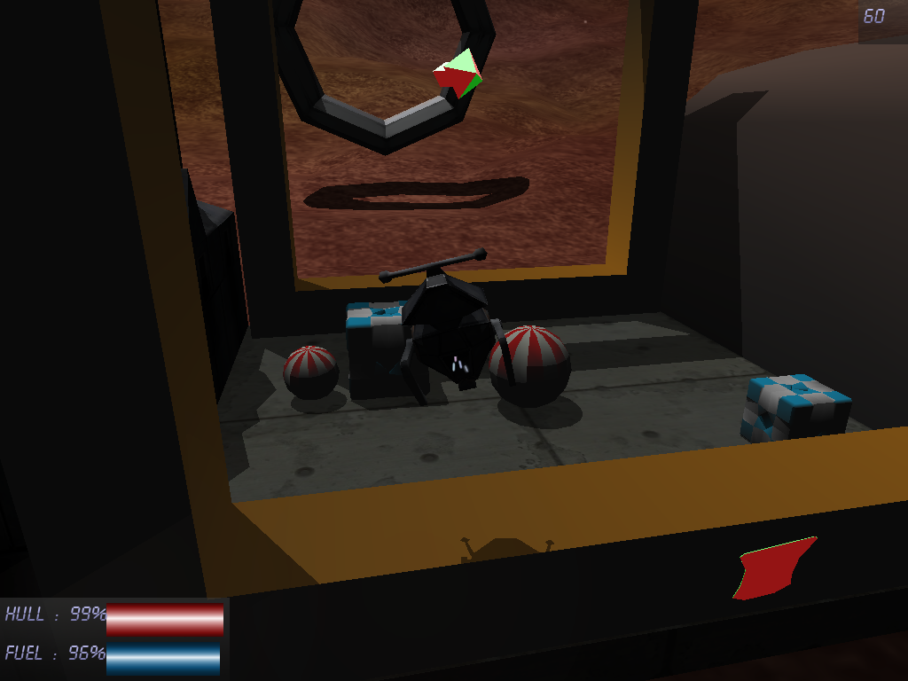
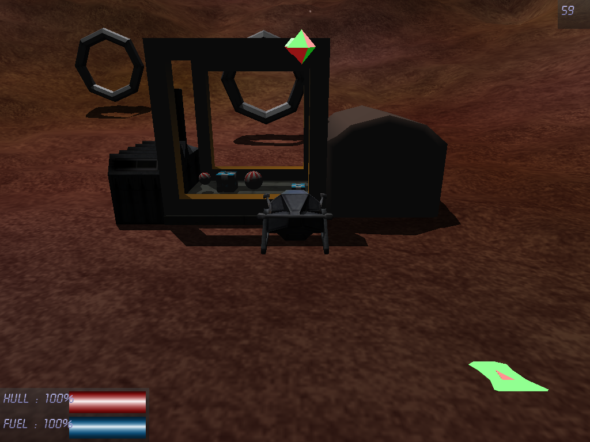

project Hopper
==============

1. A lil' bit of history :
--------------------------

This project was my first "serious" 3D project. I made a few rotating cubes back in the early 90's and fiddled with a few 3D engines before, but nothing more. And I never used a physics engine before.

My intial goal was to replicate the Psygnosis' Lander ship control in a very simple gameplay : landing on landing pads without crashing.
Learning Ogre3D + OgreOde was moderately hard, but the hardest part was the nearly-perfect replication of the Lander controls.

When I finally found a working approach to the problem, I added a material-based collision system, a level editor, gameplay modes, a tutorial, a minimal GUI system, a configurable input manager, and then dreamed of procedurally generated interior levels. 

And I tried, but lost my motivation along the way. Maybe it was too hard for me. And I had no real idea on how to handle physics in big levels, without speaking about portalization of such levels. Also, I was not happy about the project's code architecture.

2. Sources :
------------

The sources of the project are included in this package.
I'm ashamed about most of them. You will notice odd naming conventions ( some of which changed in the middle of the project ), french comments, old chunks of code still commented ( even though I was using a VCS ), convoluted code structures, and abuse of inheritance amongs other strangeness.

3. Compiling :
--------------

Good luck !
No, really. 
You should be mad to attempt such a thing.
I think the only piece of code worth saving is the lander orientation method. Ok, maybe the input configuration part, too.
 
From the top of my head :
The dependencies are : Ogre3D ( w/ plugins), OIS, OgreOde, ode, sqlite, sqlite3x, openAL.
Everything is in the Code::Blocks project file.
Oh, I was using MingW's gcc which was using .dll directly for linking.

4. License :
------------

WTFPL

5. contact :
------------
marc.p.michel@gmail.com

https://hopp3r.wordpress.com/

6. Screenshots:
---------------

7. Youtube:
---------------

